# User Interaction Workflow - GUI Application

## User Interaction Flowchart

```mermaid
flowchart TD
    Start([User Launches GUI]) --> Init[Initialization Tab Opens<br/>Auto-loaded]
    
    Init --> FillData[User Expands Collapsible Sections<br/>& Inputs Data]
    
    FillData --> Upload[User Presses<br/>'Upload Initialization Data']
    
    Upload --> Unlock{Tabs & Features Unlocked:<br/>✓ Visualization Tab<br/>✓ Extruder Control Tab<br/>✓ Overview Tab populated}
    
    Unlock --> PrePrint[Pre-Print Phase:<br/>User can navigate freely]
    
    PrePrint --> Choice1{User Chooses Action}
    
    Choice1 -->|View Data| Viz[Access Visualization Tab]
    Choice1 -->|Control Extruder| Ext[Access Extruder Control Tab]
    Choice1 -->|Check Overview| Over[Access Overview Tab]
    Choice1 -->|Modify Parameters| FillData
    Choice1 -->|Continue Setup| InitBtn[Press 'Initialization' Button]
    
    Viz --> Choice1
    Ext --> Choice1
    Over --> Choice1
    
    InitBtn --> StillFree[Initialization Complete<br/>All tabs still accessible]
    
    StillFree --> Choice2{User Chooses Action}
    
    Choice2 -->|View Data| Viz2[Access Visualization Tab]
    Choice2 -->|Control Extruder| Ext2[Access Extruder Control Tab]
    Choice2 -->|Check Overview| Over2[Access Overview Tab]
    Choice2 -->|Begin Print| StartBtn[Press 'Start' Button]
    
    Viz2 --> Choice2
    Ext2 --> Choice2
    Over2 --> Choice2
    
    StartBtn --> StateChange{State Change:<br/>✓ Extruder Control DISABLED<br/>✓ Viewer/Visualization ENABLED<br/>✓ Print Controls ENABLED}
    
    StateChange --> Printing[Print In Progress]
    
    Printing --> Monitor[User Monitors Print:<br/>- View visualization<br/>- Check progress]
    
    Monitor --> PrintChoice{User Action During Print}
    
    PrintChoice -->|Continue| Monitor
    PrintChoice -->|Need to Stop| Stop[Press 'Stop' Button]
    PrintChoice -->|Temporary Hold| Pause[Press 'Pause' Button]
    PrintChoice -->|Critical Issue| Emergency[Press 'Emergency Stop' Button]
    
    Pause --> Paused[Print Paused]
    Paused --> Resume{Resume Print?}
    Resume -->|Yes| ResumeBtn[Press 'Resume' Button]
    Resume -->|No, Stop| Stop
    ResumeBtn --> Printing
    
    Stop --> End([Print Stopped<br/>Session Complete])
    Emergency --> End
    
    Printing -->|Print Completes| End

    style Start fill:#d5e8d4,stroke:#82b366,stroke-width:2px,color:#000
    style End fill:#f8cecc,stroke:#b85450,stroke-width:2px,color:#000
    style Init fill:#dae8fc,stroke:#6c8ebf,stroke-width:2px,color:#000
    style FillData fill:#dae8fc,stroke:#6c8ebf,stroke-width:2px,color:#000
    style Upload fill:#fff2cc,stroke:#d6b656,stroke-width:2px,color:#000
    style Unlock fill:#ffe6cc,stroke:#d79b00,stroke-width:2px,color:#000
    style PrePrint fill:#e1d5e7,stroke:#9673a6,stroke-width:2px,color:#000
    style Viz fill:#f5f5f5,stroke:#666666,stroke-width:2px,color:#333333
    style Ext fill:#f5f5f5,stroke:#666666,stroke-width:2px,color:#333333
    style Over fill:#f5f5f5,stroke:#666666,stroke-width:2px,color:#333333
    style InitBtn fill:#fff2cc,stroke:#d6b656,stroke-width:2px,color:#000
    style StillFree fill:#e1d5e7,stroke:#9673a6,stroke-width:2px,color:#000
    style Viz2 fill:#f5f5f5,stroke:#666666,stroke-width:2px,color:#333333
    style Ext2 fill:#f5f5f5,stroke:#666666,stroke-width:2px,color:#333333
    style Over2 fill:#f5f5f5,stroke:#666666,stroke-width:2px,color:#333333
    style StartBtn fill:#fff2cc,stroke:#d6b656,stroke-width:2px,color:#000
    style StateChange fill:#ffe6cc,stroke:#d79b00,stroke-width:2px,color:#000
    style Printing fill:#b1ddf0,stroke:#10739e,stroke-width:2px,color:#000
    style Monitor fill:#d5e8d4,stroke:#82b366,stroke-width:2px,color:#000
    style Stop fill:#f8cecc,stroke:#b85450,stroke-width:2px,color:#000
    style Pause fill:#f8cecc,stroke:#b85450,stroke-width:2px,color:#000
    style Emergency fill:#a20025,stroke:#6F0000,stroke-width:2px,color:#ffffff
    style Paused fill:#fad7ac,stroke:#b46504,stroke-width:2px,color:#000
    style ResumeBtn fill:#d5e8d4,stroke:#82b366,stroke-width:2px,color:#000
```



## Workflow States Summary

### 1. **Initial State**
- Only Initialization Tab is accessible
- All other features locked

### 2. **Post-Upload State** (After 'Upload Initialization Data')
- ✅ Visualization Tab enabled
- ✅ Extruder Control Tab enabled
- ✅ Overview Tab populated with data
- User has full control and can navigate freely

### 3. **Post-Initialization State** (After 'Initialization' Button)
- All tabs remain accessible
- System configured and ready for printing
- User can still make adjustments

### 4. **Active Print State** (After 'Start' Button)
- ❌ Extruder Control Tab **DISABLED**
- ✅ Visualization/Viewer **ACCESSIBLE**
- ✅ Print Control Buttons **ENABLED**:
  - Stop
  - Pause
  - Resume (when paused)
  - Emergency Stop

### 5. **Paused State**
- Print temporarily halted
- User can resume or stop completely
- Visualization remains accessible

### 6. **Completed/Stopped State**
- Print finished or terminated
- Session complete

## Key User Decision Points

1. **After Upload**: Choose to explore tabs or proceed with initialization
2. **After Initialization**: Choose to make final checks or start printing
3. **During Print**: Monitor, pause, stop, or emergency stop
4. **When Paused**: Resume or terminate print

## Access Control Matrix

| Feature/Tab | Initial | Post-Upload | Post-Init | During Print | Paused |
|-------------|---------|-------------|-----------|--------------|--------|
| Initialization Tab | ✅ | ✅ | ✅ | ❌ | ❌ |
| Visualization Tab | ❌ | ✅ | ✅ | ✅ | ✅ |
| Extruder Control | ❌ | ✅ | ✅ | ❌ | ❌ |
| Overview Tab | ❌* | ✅ | ✅ | ✅ | ✅ |
| Print Controls | ❌ | ❌ | ❌ | ✅ | ✅ |

*Overview Tab is accessible but empty until data is uploaded
```
